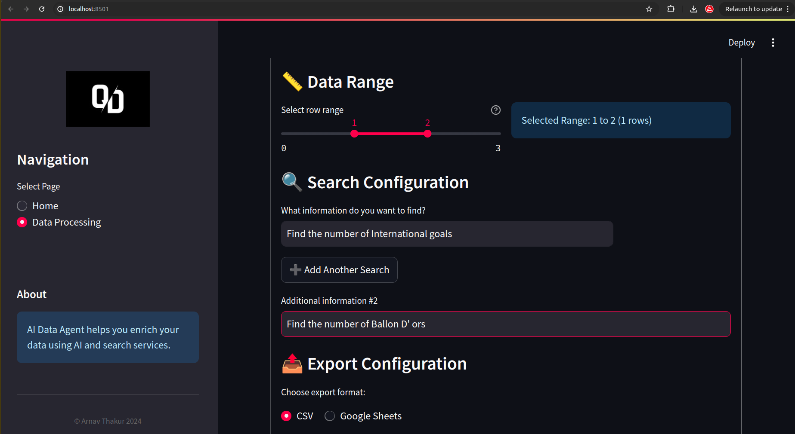

# AI Data Agent

An AI-powered data agent that processes data from CSV files or Google Sheets, performs searches using LLMs, and provides insights through a Streamlit interface.


## Features

- Upload CSV files or connect to Google Sheets.
- Perform entity extraction and search using LLMs.
- Display and download processed data.


## Data Upload

*Upload your CSV files or connect to Google Sheets*

## Data Summary

*Select any number of coloumns as you wish*

## Search Interface

*Select the range of data you need to process along with multiple query option*

## Results View

*Choose the export option and view and analyze processed data*

## Quick Start Guide

Watch our quick demo video to get started:

[](https://youtu.be/your-video-id)

### Step 1: Upload Data
1. Launch the application
2. Click "Upload CSV" or "Connect Google Sheets"
3. Select your data source

### Step 2: Process Data
1. Choose processing options
2. Click "Process Data"
3. Wait for AI analysis

### Step 3: View Results
1. Explore the processed data
2. Download results if needed
3. Perform additional searches

## Setup

1. Clone the repository.

2. Create and activate a virtual environment:

   ```sh
   python3 -m venv .venv
   source .venv/bin/activate
   ```

3. Install the required packages:

   ```sh
   pip install -r requirements.txt
   ```

4. Set up environment variables in the `.env` file:

   ```txt
   GEMINI_API_KEY=your_gemini_api_key
   SERPAPI_API_KEY=your_serpapi_api_key
   ```

5. Obtain Google Sheets API credentials:
   - Place your `credentials.json` file in the config directory.

6. Configure the application settings in `config.yaml`.

## Running the Application

Run the setup script:

```sh
./setup.sh
```

Start the application:

```sh
./run.sh
```

Access the application at `http://localhost:8501`.

## Testing

Run the unit tests in the `tests` directory:

```sh
python -m unittest discover tests
```

## Project Structure

- `config/`: Configuration files
  - `config.yaml`: Application configuration
  - `credentials.json`: Google API credentials
  - `token.json`: OAuth token
- `src/`: Source code
  - `dashboard/`: UI components
    - `ui.py`: Streamlit interface
  - `services/`: Core services
    - `csv_handler.py`: CSV file operations
    - `llm_service.py`: Language model service
    - `search_service.py`: Search functionality
    - `sheets_handler.py`: Google Sheets integration
  - `utils/`: Utility functions
    - `env_utils.py`: Environment variables
    - `helpers.py`: Helper functions
    - `rate_limiter.py`: Rate limiting
    - `setup.py`: Setup utilities
  - `main.py`: Application entry point
- `tests/`: Unit tests
  - `test_csv_handler.py`
  - `test_llm_service.py`
  - `test_search_service.py`
  - `test_sheets_handler.py`
  - `test_ui.py`
- `.env`: Environment variables
- `README`: Project documentation
- `requirements.txt`: Dependencies
- `run.sh`: Run script
- `setup.sh`: Setup script
