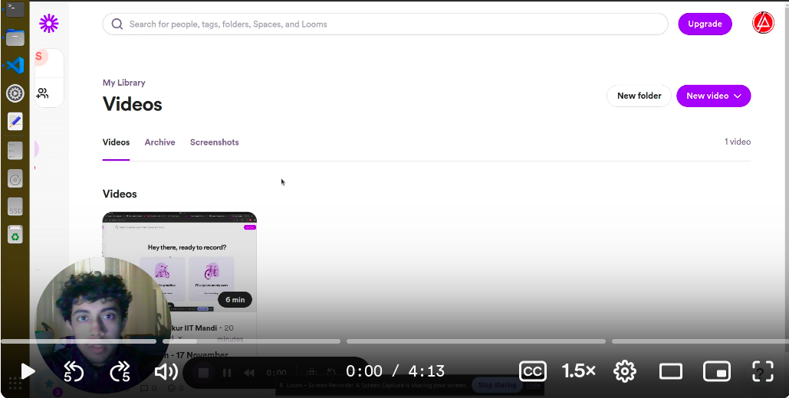

<div align="center">

# QuickData


QuickData is an AI-powered data agent that processes data from CSV files or Google Sheets, performs searches using LLMs, and provides insights through a Streamlit interface. 

[Features](#features) • [Screenshots](#screenshots) • [Demo](#demo-video) • [User Guide](#user-guide) • [Setup](#setup) • [Run](#running-the-application) • [Testing](#testing)


</div>

---

## Features

- Upload CSV files or connect to Google Sheets
- Perform entity extraction and search using LLMs
- Display and download processed data
- Multiple Column Selection with Preview (Added utility)
- Row Range Selection via Slider Interface (Added utility)
- Multiple Queries for a single entity (Added utility)
- Export result to google sheets via google sheets API integration (Added utility)

## Screenshots


  <tr>
    <td width="100%" style="padding: 0;">
      
      <p style="margin-top: 150px; margin-bottom: 150px; text-align: center;"><i>Data Upload Interface</i></p>
    </td>
  </tr>


  <tr style="margin-bottom: 100px;">
    <td width="100%" style="padding: 0;">
      
      <p style="margin-top: 150px; margin-bottom: 150px; text-align: center;"><i>Search Interface</i></p>
    </td>
  </tr>

 
  <tr style="margin-bottom: 100px;">
    <td width="100%" style="padding: 0;">
      
      <p style="margin-top: 150px; margin-bottom: 150px; text-align: center;"><i>Results View</i></p>
    </td>
  </tr>


## Demo Video

<details open>
<summary>Watch the quick demo video</summary>
<br>
<a href="https://www.loom.com/share/4e832bcaf3094614ab7683caefe49090?sid=19e8459e-99e2-447d-8f2d-8907610cdc27">
    
</a>
</details>

## User Guide
<details>
<summary>Click to expand the user guide</summary>
  
### Step 1: Upload Data
1. Launch the application
2. Click "Upload CSV" or "Connect Google Sheets"
3. Select your data source

### Step 2: Process Data
1. Choose processing options
2. Click "Process Data"
3. Wait for AI analysis

### Step 3: View Results
1. Explore the processed data
2. Download results if needed
3. Perform additional searches
</details>

## Setup

<details>
<summary>Click to expand setup instructions</summary>

1. Clone the repository.

2. Create and activate a virtual environment:

   ```sh
   python3 -m venv .venv
   source .venv/bin/activate
   ```

3. Install the required packages:

   ```sh
   pip install -r requirements.txt
   ```

4. Set up environment variables in the `.env` file:

   ```txt
   GEMINI_API_KEY=your_gemini_api_key
   SERPAPI_API_KEY=your_serpapi_api_key
   ```

5. Obtain Google Sheets API credentials:
   - Place your `credentials.json` file in the config directory.

6. Configure the application settings in `config.yaml`.

</details>

## Running the Application
<details>
<summary>Click to expand running and starting instructions</summary>

Run the setup script:

```sh
./setup.sh
```

Start the application:

```sh
./run.sh
```

Access the application at `http://localhost:8501`.
</details>

## APIs and tools
<details>
<summary>Click to expand tech stack</summary>
  
### Third-Party API Integrations
- **Groq API**: Fast LLM inference using Mixtral-8x7B model
- **SerpAPI**: Web search functionality with structured results
- **Google Sheets API**: Seamless spreadsheet integration

### Tools & Libraries
- **Streamlit**: Interactive web interface
- **Pandas**: Data manipulation and analysis
- **Python-dotenv**: Environment variable management
- **Google OAuth2**: Authentication for Google Services
- **PyYAML**: Configuration management

### Supported Data Formats
- CSV files (*.csv)
- Google Sheets
- Exported results in CSV/Sheets format
</details>

## Testing
<details>
<summary>Click to expand testing Instructions</summary>
  
Run the unit tests in the `tests` directory:

```sh
python -m unittest discover tests
```
</details>

